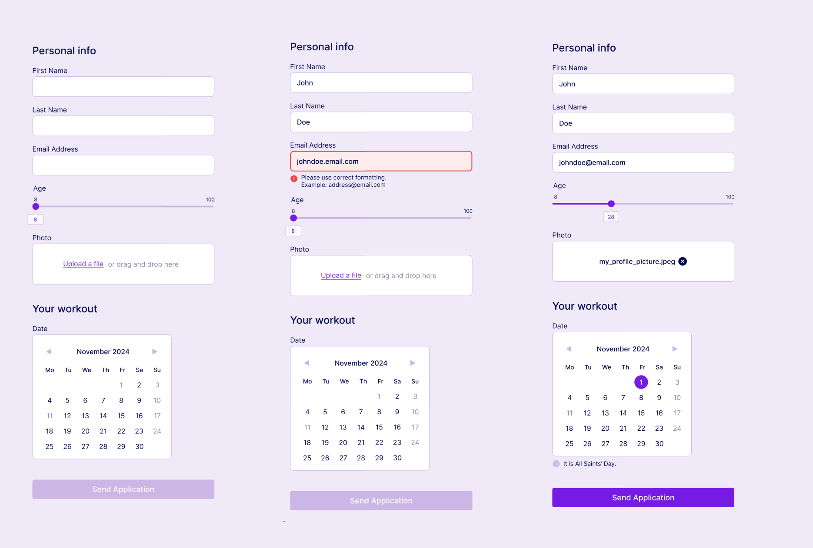

# Formularz - Zadanie Rekrutacyjne



Aplikacja to prosty formularz rejestracyjny umożliwiający zapis na trening. Użytkownik wprowadza swoje dane, wybiera termin, a następnie potwierdza zgłoszenie. Aplikacja zapewnia intuicyjny interfejs i szybki proces rejestracji.
Strona jest dostępna na żywo pod adresem.

```sh

```

## 📌 Funkcjonalności

### 1. Formularz rejestracyjny

- **Imię i nazwisko** – pole tekstowe do wpisania danych osobowych.
- **Adres e-mail** – pole do podania e-maila w celu potwierdzenia rejestracji.
- **Wiek** – suwak do zaznaczenia wieku w przedziale od 8 do 100 lat.
- **Zdjęcie** – pole do wgrania swojego zdjęcia (plik musi ważyć mniej niż 2 MB).

Formularz składa się z pól, w które należy wpisać swoje imię, nazwisko i adres e-mail. Wszystkie te pola są walidowane – sprawdzana jest ich poprawność oraz to, czy nie pozostawiono ich pustych. W przypadku błędnych lub brakujących danych pojawia się komunikat błędu.

### 2. Wybór terminu treningu

- **Kalendarz** – interaktywny wybór miesiąca i dnia treningu.
- **Godzina treningu** – lista dostępnych godzin do wyboru.
- **Ograniczenia** – na kalendarzu nie można zapisać się w dni świąteczne i wolne od pracy. W takich przypadkach wyświetlany jest komunikat "It is a holiday" lub "It is [nazwa święta]".
- **Dni pracujące** – po kliknięciu w dostępny dzień można wybrać jedną z kilku dostępnych godzin treningu.

### 3. Walidacja danych

- Sprawdzenie, czy wszystkie wymagane pola są wypełnione.
- Walidacja poprawności e-maila i wieku.
- Weryfikacja rozmiaru wgrywanego zdjęcia (maksymalnie 2 MB).

### 4. Powiadomienia

Dla lepszego wyglądu komunikatów o błędach i potwierdzeniach zainstalowano dodatkowo bibliotekę **React Toastify**, która zapewnia estetyczne powiadomienia.

## 🛠 Technologie

- React
- TypeScript
- Tailwind CSS
- Sass
- React Calendar
- Prettier
- Axios
- React Toastify
- Dotenv

## 🚀 Instalacja i uruchomienie

1. **Sklonuj repozytorium**:

   ```sh
   git clone https://github.com/Jakubba/Zadanie-Rekrutacyjne-Form.git
   cd Zadanie-Rekrutacyjne-Form
   ```

2. **Zainstaluj zależności**:

   ```sh
   npm install
   npm install tailwindcss @tailwindcss/vite
   npm install --save-dev prettier
   npm install sass
   npm install react-calendar
   npm install axios
   npm install react-toastify
   npm install dotenv
   ```

3. **Uruchom aplikację**:
   ```sh
   npm run dev
   ```
   Aplikacja będzie dostępna pod adresem `http://localhost:5173/` (jeśli używasz Vite).

## 💀 Struktura projektu

```
📆 src
 └─└ assets        # Media
 └─└ components    # Komponenty formularza
 └─└ styles        # Style Sass
 └─┄ types.ts      # Definicje typów TypeScript
 └─┄ .prettierrc   # Ustawienia Prettiera
 └─┄ main.tsx      # Punkt wejściowy aplikacji
```

## 🐟 Licencja

Projekt dostępny na licencji MIT.

---

📌 **Autor:**
**Jakub Barszcz**
